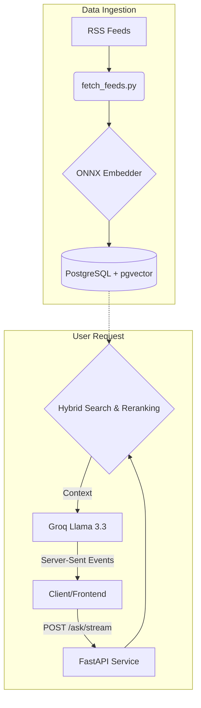

# DevSec-Brief

<div align="center">
  
  
  
  
  
</div>

<br>

A full-stack RAG-powered AI news system that aggregates, processes, and serves developer and cybersecurity news.

---

## Architecture & Tech Stack

- **Backend:** Python, FastAPI
- **AI/RAG:** Groq (`llama-3.3-70b-versatile`), ONNX embeddings (`BAAI/bge-m3`), ONNX Cross-Encoder (`mMARCO`)
- **Database:** PostgreSQL 16 + pgvector (Persistent vector and metadata storage)
- **Infrastructure:** Docker, Docker Compose

### System Architecture



---

## Core Features

- Automated fetching of DevSec feeds (`fetch_feeds.py`).
- Entity extraction and semantic chunking using zero-VRAM CPU-optimized ONNX binaries.
- RAG-augmented querying with hybrid search and cross-encoder reranking (`rag.py`).
- Server-Sent Events (SSE) streaming endpoint for frontend integration (`api.py`).

---

## Quick Start (Docker)

```bash
# Clone the repo
git clone https://github.com/ima-d-ice/devsec-brief.git
cd devsec-brief

# Set up environment variables
touch .env
# Add: GROQ_API_KEY=gsk_your_groq_api_key_here

# Build and run the containers
docker compose up --build -d
```

> [!NOTE] 
> On the first boot, the container compiles the INT8 ONNX binaries into `/data`. The API is exposed on `http://127.0.0.1:8000`.

---

## API Reference

**`POST /ask`**
Standard JSON response containing the full synthesized answer and source citations.

```bash
curl -X POST "http://127.0.0.1:8000/ask" \
     -H "Content-Type: application/json" \
     -d '{"query": "What are the latest zero-day vulnerabilities in Linux?", "k": 5}'
```

**`POST /ask/stream`**
For real-time UI integrations. Streams the sources array first, followed by live LLM tokens.

```bash
curl -N -X POST "http://127.0.0.1:8000/ask/stream" \
     -H "Content-Type: application/json" \
     -d '{"query": "How is quantum computing impacting RSA encryption?", "k": 5}'
```

---

## Project Structure

- `/src`: Python backend (RAG logic, API endpoints, entity extraction, ONNX compilation).
- `/data`: Persistent Volume (compiled ONNX models, JSON glossary).
- `Dockerfile` & `docker-compose.yml`: Container configuration.
- `entrypoint.sh`: Boot script for automated model compilation and API startup.

---

## Benchmarks

### Latency Performance
When deployed natively inside the Docker container, the CPU-only retrieval pipeline yields the following latencies:
- **Vector Lookup:** ~8ms
- **Semantic Embedding:** ~110ms
- **Cross-Encoder Reranking:** ~280ms
- **Average Total Retrieval:** `~398.5ms`

### RAGAS Evaluation Scores
The system has been evaluated using the RAGAS framework for accuracy and contextual relevance:
- **Context Precision:** 83.0% (0.8300)
- **Faithfulness:** 75.7% (0.7570)
- **Answer Relevancy:** 64.3% (0.6430)
