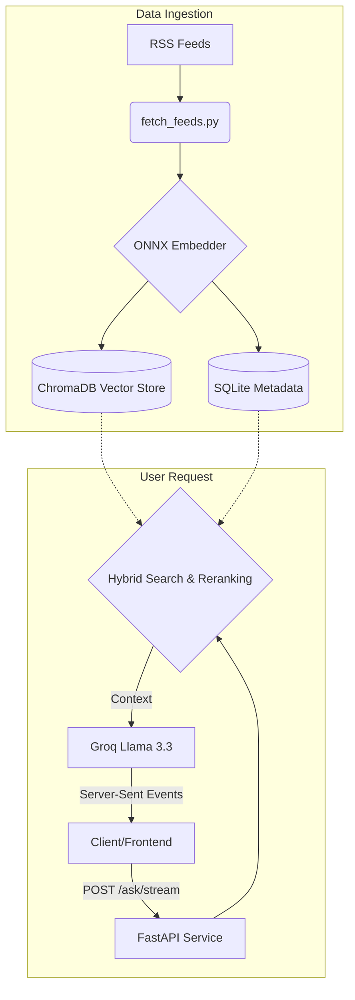

# DevSec Brief

<div align="center">
  
  
  
  
  
</div>

<br>

**DevSec Brief** is a highly optimized, enterprise-grade Retrieval-Augmented Generation (RAG) engine designed specifically for software developers and cybersecurity professionals. 

It autonomously aggregates real-time intelligence from top-tier RSS feeds (Hacker News, MDN, CISA, NCSC, etc.), stores them in a persistent local vector database, and utilizes **Groq's Llama 3.3 70B** to synthesize lightning-fast, highly accurate answers.

---

## Enterprise-Grade Architecture

DevSec Brief is engineered to run **entirely on standard CPU cores** for its retrieval pipeline, maintaining a **Zero-VRAM footprint**. This allows you to deploy the system cheaply on generic cloud instances or locally alongside heavy multi-agent GPU workloads.

- **Automated Intelligence Pipeline:** Periodic background ingestion and semantic chunking of industry RSS feeds.
- **CPU-Optimized Hybrid Search:** Combines keyword routing with dense semantic vector search powered by **8-bit Quantized ONNX** embedding models (`BAAI/bge-m3`).
- **Cross-Encoder Reranking:** Candidate documents are rigorously re-scored using an ONNX-optimized cross-encoder (`mMARCO`) to eliminate hallucinations.
- **Sub-Second TTFT:** Blazing fast Time-To-First-Token (~800ms) achieved via SSE Streaming endpoints and Groq's LPU inference architecture.

### System Architecture



---

## Quickstart (Docker)

The absolute easiest way to deploy the system is via Docker. The container handles OS dependencies, ONNX compilation, and automatic database provisioning out of the box.

### 1. Configure Environment
Clone the repository and create your environment file:
```bash
git clone https://github.com/ima-d-ice/devsec-brief.git
cd devsec-brief
touch .env
```

Add your Groq API key to the `.env` file:
```text
GROQ_API_KEY=gsk_your_groq_api_key_here
```

### 2. Launch the Engine
Spin up the container in detached mode:
```bash
docker compose up --build -d
```

> [!NOTE] 
> On the very first boot, the container will take 1-2 minutes to download base models and compile the INT8 ONNX binaries. The `/data` directory is mounted locally to persist your vectors and binaries between restarts.

---

## API Reference

The engine exposes a high-performance REST API running by default on `http://127.0.0.1:8000`.

### 1. Standard Generation
**`POST /ask`**
Standard JSON response containing the full synthesized answer and the exact source citations.

```bash
curl -X POST "http://127.0.0.1:8000/ask" \
     -H "Content-Type: application/json" \
     -d '{"query": "What are the latest zero-day vulnerabilities in Linux?", "k": 5}'
```

### 2. Streaming Generation (SSE)
**`POST /ask/stream`**
For real-time UI integrations. Streams the sources array first, followed by live LLM tokens.

```bash
curl -N -X POST "http://127.0.0.1:8000/ask/stream" \
     -H "Content-Type: application/json" \
     -d '{"query": "How is quantum computing impacting RSA encryption?", "k": 5}'
```

---

## Project Structure

```text
devsec-brief/
├── Dockerfile                  # Production-ready Python 3.12 container
├── docker-compose.yml          # Container orchestration & volume mapping
├── entrypoint.sh               # Intelligent boot script (Auto-compiles ONNX)
├── requirements.txt            # Python dependencies (optimum, onnxruntime, etc)
├── data/                       # Persistent Volume (Vector DB, SQLite, ONNX models)
│   ├── entity_glossary.json    # Domain-specific tech terms for keyword routing
│   └── feeds_config.json       # RSS feed target definitions
└── src/                        # Core backend logic
    ├── api.py                  # FastAPI routing & SSE streaming
    ├── rag.py                  # Hybrid search & Cross-Encoder pipeline
    ├── refresh.py              # Data ingestion orchestrator
    ├── fetch_feeds.py          # HTML stripping & BeautifulSoup parsing
    ├── export_st_onnx.py       # PyTorch -> INT8 ONNX quantization compiler
    └── groq_client.py          # LLM Generation wrapper
```

---

## Benchmarks

### Latency Performance
When deployed natively inside the Docker container (running on macOS Apple Silicon / Linux equivalents), the CPU-only retrieval pipeline yields the following latencies:

- **Vector Lookup:** ~8ms
- **Semantic Embedding:** ~110ms
- **Cross-Encoder Reranking:** ~280ms
- **Average Total Retrieval:** `~398.5ms`

### RAGAS Evaluation Scores
The system has been evaluated using the RAGAS framework for accuracy and contextual relevance:
- **Context Precision:** 83.0% (0.8300)
- **Faithfulness:** 75.7% (0.7570)
- **Answer Relevancy:** 64.3% (0.6430)
